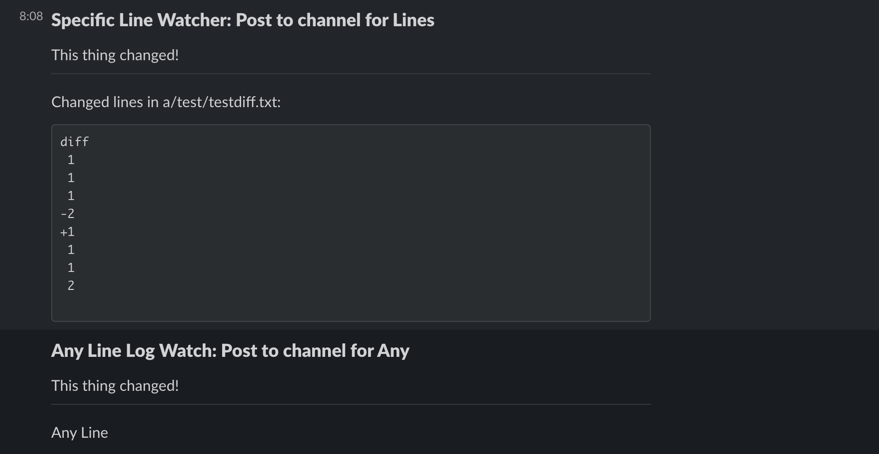

# diffhook

`diffhook` is a tool to allow you to attach actions (triggers) to changes in files and lines of code. It lets you create
soft dependencies between parts of your code and other systems/codebases/documents/etc...

## Example use cases

- Does a backend change require a detached frontend to also update? Trigger a Jira ticket (WIP) and Slack notification
  to your frontend team
- Other repos that import your repo as an SDK (this should be managed by proper software dependency management, but you
  can use diffhook to notify people)
- Get alerts when a sensitive or secure part of code is changed
- Do you have documentation for an API or flow? Keep it up to date by getting notified when the code changes!
- Adding to a string-based list like a set of roles or filters and need to add it in several systems? Setup logs to tell
  where else the value needs to be added
- Need to trigger a cache clear when a file gets deleted? Use a webhook action (when they're built!)

## Installing

The easiest way to get started is downloading the precompiled binary and using the CLI tool locally.

If you have a go environment setup you can run:

```bash
go get github.com/bennettaur/diffhook
go install github.com/bennettaur/diffhook/cli
```

## Configuring

By default, the tool looks for a file named `.diffhook.yml` in the current directory. A `.diffhook.yml` file will
contain a set of "watchers" which contain details about the file to watch and what should trigger that watcher (ex.
specific lines, any line, file being renamed)and a set of actions to perform when triggered (ex. Print out a message or
send a message to a slack channel).

Fields of a `.diffhook.yml`:

```yaml
watchers: # This is the collection of watchers
  - name: Example Name # Name of the watcher
    file_path: some/file/path # Path of the file to watch, relative to the root
    lines: # The lines within the file to watch (inclusively). For a single line the startline and endline should be the same. Multiple can be specified
      - startline: 20
        endline: 30
    actions: # All of the actions to run and their configuration
      - type: slack # the type of the action. Must be one of the supported types and lowercase
        name: Slaction # Name of the action for easy identification
        channel: SomeChannel # Slack specific: Channel to post in, see the Setting Up Slack below for more details
        message: This thing changed! # The message to post in the channel when this action runs!
      - type: log # A simple logging type action. Will just print out a message to stdout
        name: Log
        message: Log Action
  - name: Multiple Line Log Watch # Example of a second action
    file_path: a/test/testdiff.txt
    lines:
      - startline: 90
        endline: 100
      - startline: 30
        endline: 40
    trigger_any: true # Trigger on any change to this file
    trigger_any_line: true # Trigger if any line changes in the file. Will not trigger if other types of changes are made to the file
    trigger_on_rename: true # Trigger if the file is renamed, but not moved
    trigger_on_move: true # Trigger if the file is moved to another directory
    trigger_on_delete: true # Trigger if the file is deleted
    trigger_on_mode: true # Trigger if any of the file permissions are changed
    actions:
      - type: log
        message: Log Action
```

An example might look like:

```yaml
watchers:
  - name: Slack Watcher
    file_path: a/test/testdiff.txt
    lines:
      - startline: 20
        endline: 30
      - startline: 50
        endline: 50
      - startline: 70
        endline: 80
    actions:
      - type: slack
        channel: SomeChannel
        message: This thing changed!
  - name: Multiple Line Log Watch
    file_path: a/test/testdiff.txt
    lines:
      - startline: 90
        endline: 100
    trigger_on_rename: true
    trigger_on_move: true
    actions:
      - type: log
        message: Log Action
```

## Running in CI

To add to your CI builds you'd roughly want to:

- Add a step to install the pre-built binary into your CI image, ideally before a `checkout & install` so that the step
  can be cached
    - Alternatively, add the binary to some base build image (assuming you're using Docker/containers) for better
      caching as well
- After the step that checks out your code, add a new step that runs the diffhook CLI. You can either specify the `git
  diff` command to run and pipe it into the CLI, or have the CLI run the diff for you
  
```bash
# Pipe diff to diffhook
git diff origin/main | diffhook

# Let diffhook run git for you. Note you only need to specify the branch name, it will always use origin
diffhook -g main
```

## Setting Up Slack

- Register a slack app in your org here: https://api.slack.com/apps?new_app=1
    - You can customize the name, if you like, or keep it `diffhook`
    - Choose the slack workspace you want diffhook to post in
- Under OAuth & Permissions add the following scopes:
    - `chat:write`, `chat:write.public`, `channels:read`, `groups:read`
    - A Future version will provide a CLI for configuring this (https://api.slack.com/authentication/oauth-v2)
- Install the Slack App into your workspace (you should be prompted for this)
    - Select any channel
- Add the bot to any private channels you want it to post to
    - Just send `@diffhook` in the channel
- Use the generated Bot OAuth Token to set the `SLACK_TOKEN` environment variable

Example:



## Todo

### Core

- [ ] Documentation for how to setup and use
- [ ] Add better logging [zerolog?](https://github.com/rs/zerolog)
- [ ] Add validation with [ozzo-validation](https://github.com/go-ozzo/ozzo-validation)
- [ ] Slack OAuth setup
- [ ] Integrate with Github API
- [ ] Generate update for watchers when lines changes
- [ ] Comment support? Add a tag as comment in code to watch it?
- [ ] Support string interpolation in action messages?
- [ ] Generic webhook action
- [ ] Support specifying specific branches to trigger on or actions to run on (similar to CI `only_on`)...
- [ ] Add better formatting support of messages (ex. colours)
- [ ] Improve slack formatting

### CLI

- [ ] Add easy setup of git hooks
- [ ] Add a local/ci mode so that certain actions aren't triggered when running local (ex. slack) kind of like a log
  only mode
- [ ] Add an action filter to CLI so only user specific action types are run
- [ ] List configured watchers & actions
- [ ] Test specific actions
- [ ] Allow specifing a custom diffhook file to use
- [ ] Generate a template .diffhook.yml file
- [ ] Generate an action template
- [ ] List the names of the supported action types
- [ ] Directory/multiple .diffhook.yml file to support?
- [ ] Support different output formats (html, xml)?
- [ ] Support determining the branch being merged into for generating the diff (ex. through github?)
- [x] support specifying the branch to compare to
- [ ] automatically detect main branch, ~~and fetch it if it isn't present~~
- [ ] Add a fail type action so that a CI step can fail?

### Server

- [ ] Split out web server & [mongo](https://github.com/Kamva/mgm)
- [ ] Build proper server mode (and add two-way linking)